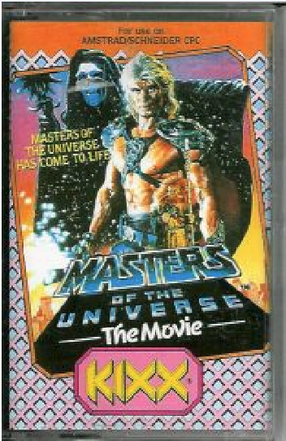

# Masters of the Universe: The Movie – Amstrad CPC Archive

## Overview

*Masters of the Universe: The Movie* on the Amstrad CPC and Schneider CPC computers is an action-adventure adaptation of the 1987 live-action Cannon Films feature. Developed by Gremlin Graphics and later re-released under U.S. Gold's budget imprint **KIXX**, the game places players in control of He-Man as he explores Earth to recover the Cosmic Key's missing chord tones and fend off Skeletor's forces.

This folder archives verified media assets from the original physical European cassette release.

---

## Archived Media Assets

### 1. Cassette Box Art (`He-Man_MOTU_CPC_Box.PNG`)

* **Physical Format:** Standard European Compact Cassette jewel case inlay.
* **Compatibility Banner:** `"For use on AMSTRAD/SCHNEIDER CPC"`
* **Marketing Tagline:** `"MASTERS OF THE UNIVERSE HAS COME TO LIFE"`
* **Title:** `"MASTERS OF THE UNIVERSE – The Movie"`
* **Publisher Imprint:** **KIXX** (budget re-release label by U.S. Gold, circa 1989/1990).
* **Cover Art Description:** Depicts Dolph Lundgren as He-Man in movie armor holding the sword, with Frank Langella's Skeletor looming menacingly in the upper-left cosmic background.

---

### 2. In-Game Screenshot (`MOTU-movie_screen.gif`)

* **File:** `MOTU-movie_screen.gif`
* **Platform Display:** Mode 0 / Mode 1 Amstrad graphics palette.
* **Content:** Displays He-Man in the overhead town labyrinth navigating streets, dodging enemy lasers, and interacting with the game's HUD (health status, inventory, and Cosmic Key chord acquisition meter).

---

## Cross-Platform Reference

For the full navigational street map, chord coordinate breakdown, and speedrun pathing, see the sister directory:
* [Atari ST Navigation Map & Route Guide](../../AtariST/MOTU_The_Movie/README.md)
