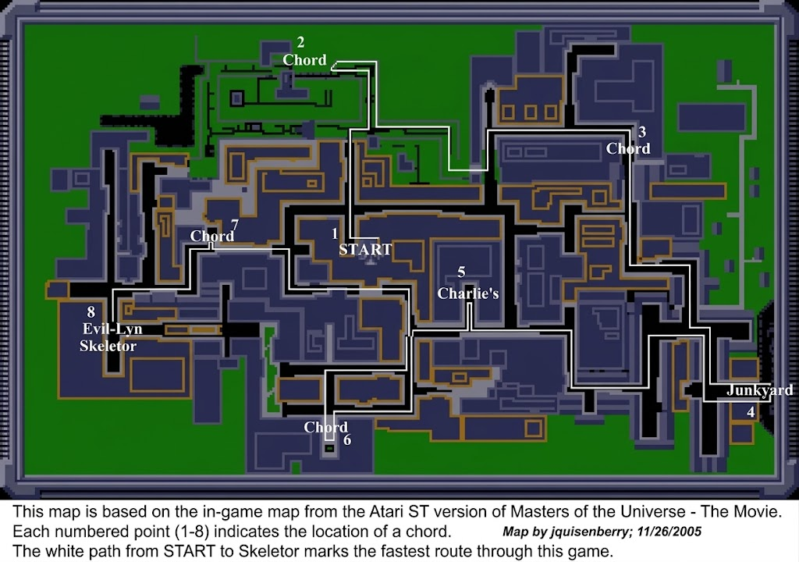

# Masters of the Universe: The Movie – Atari ST Map & Route Guide

## Overview

*Masters of the Universe: The Movie* is an action-adventure game released in 1987 by Gremlin Graphics, based on the Cannon Films live-action film starring Dolph Lundgren. On the Atari ST, the game features overhead exploration of the town where He-Man and his companions must locate the scattered musical chords of the Cosmic Key, fight Skeletor's shock troops, and defeat Evil-Lyn and Skeletor.

This document serves as the authoritative text companion to the verified speedrun and navigation map created by `jquisenberry` (November 26, 2005).

---

## Map Legend & Key Waypoints

The navigation map (`AtariST_MOTU_The_Movie_map_1024x720.jpg`) details the complete street and building layout of the town. Key points of interest are designated by numbers (1 through 8):

| Node | Name / Designation | Location on Map | Description & Objectives |
| :---: | :--- | :--- | :--- |
| **1** | **START** | Central Sector | Starting spawn point for He-Man. Begin following the white path north. |
| **2** | **Chord** | Northwest Sector | First chord collected on the optimal route. Located in the northern courtyard. |
| **3** | **Chord** | Northeast Sector | Second chord collected along the northern thoroughfare. |
| **4** | **Junkyard** | Far Southeast Corner | Critical landmark in the industrial sector containing essential items/chords. |
| **5** | **Charlie's** | South-Central Sector | Charlie's Music Store; narrative landmark central to locating the Cosmic Key frequencies. |
| **6** | **Chord** | Southern Corridor | Chord location accessed via southern city corridors. |
| **7** | **Chord** | West-Central Corridor | Fifth chord waypoint along the westbound route toward the final encounter. |
| **8** | **Evil-Lyn / Skeletor** | Southwest Sector | The final arena and stronghold where He-Man confronts Evil-Lyn and Skeletor. |

---

## Optimal Route Walkthrough (The White Path)

The solid white path drawn across the map traces the fastest verified route to clear the game:

1. **Departure from START (Node 1):** Head directly north through the central corridor between the blue urban buildings, turning northwest into the upper courtyard to acquire **Chord 2**.
2. **Eastbound Traversal to Chord 3 (Node 2 $\rightarrow$ Node 3):** Navigate east along the northern perimeter, bypassing defensive barricades until reaching the northeast sector to secure **Chord 3**.
3. **Southward Descent to the Junkyard (Node 3 $\rightarrow$ Node 4):** Follow the easternmost alleyways southward, cutting through the perimeter fence directly into the **Junkyard (Node 4)** in the far southeast.
4. **Westbound Transition Past Charlie's (Node 4 $\rightarrow$ Node 5 $\rightarrow$ Node 6):** Move west from the Junkyard, cutting through the central avenue past **Charlie's (Node 5)**, and loop into the southern cul-de-sac to secure **Chord 6**.
5. **Advancing West to Chord 7 (Node 6 $\rightarrow$ Node 7):** Retreat back north into the main westbound artery, continuing through the western corridors to collect **Chord 7**.
6. **Final Infiltration & Boss Encounter (Node 7 $\rightarrow$ Node 8):** Follow the path southwest through the final heavily fortified avenue into **Node 8** to confront **Evil-Lyn** and **Skeletor**, completing the game.

---

## Technical & Archival Notes

* **Map File:** `AtariST_MOTU_The_Movie_map_1024x720.jpg`
* **Resolution:** 1024 × 720 pixels
* **Cartographer:** `jquisenberry`
* **Date Created:** November 26, 2005
